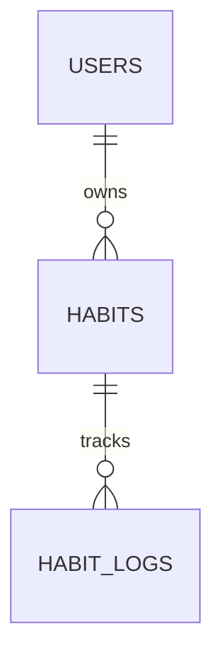

# Habit Tracker

Краткое описание:
Habit Tracker — учебный проект на FastAPI для отслеживания привычек.  
Пользователь может создавать привычки и отмечать их выполнение по датам.

---

## Статус
Проект находится в активной разработке.

Реализовано:
- модели SQLAlchemy (User, Habit, HabitLog)
- Pydantic-схемы
- регистрация и аутентификация пользователей (JWT)
- CRUD для привычек
- логирование выполнения привычек
- статистика привычек (серии, процент выполнения)

В планах:
- тесты (pytest)
- деплой
---

## Быстрый старт (Windows + PyCharm)

1. Клонировать репозиторий:
```bash
git clone https://github.com/amiamiur/habit-tracker.git
cd habit-tracker
```
2. Создать и активировать виртуальное окружение:
```bash
python -m venv .\venv
.\venv\Scripts\Activate
```
3. Установить зависимости:
```bash
pip install -r requirements.txt
```

4. Создать .env на основе .env.example и заполнить значения.

5. Запустить приложение (dev):
```bash
uvicorn app.main:app --reload --host 127.0.0.1 --port 8000
```

## Аутентификация

В проекте используется JWT Bearer authentication.

### Шаги:
1. Создать пользователя:

POST /users/

2. Получить токен:

POST /auth/token

3. В Swagger UI нажать кнопку **Authorize** и вставить:

Bearer <access_token>

После этого становятся доступны защищённые эндпоинты.

## Модель данных

В проекте используется реляционная база данных PostgreSQL. 
HabitLog хранит факт выполнения привычки по конкретной дате и используется
для расчёта серий и процента выполнения.

### Сущности
- **User** — пользователь системы
- **Habit** — привычка пользователя
- **HabitLog** — отметка выполнения привычки по дате

### Связи
- User → Habit (1:N)
- Habit → HabitLog (1:N)



## Основные эндпоинты

### Users
- POST `/users/` — регистрация пользователя

### Auth
- POST `/auth/token` — получение JWT токена

### Habits
- POST `/habits/` — создать привычку
- GET `/habits/` — список привычек пользователя
- GET `/habits/{id}` — получить привычку
- PUT `/habits/{id}` — обновить привычку
- PATCH `/habits/{id}` — частичное обновление
- DELETE `/habits/{id}` — удалить привычку
- GET `/habits/{id}/stats` — статистика привычки

### Habit Logs
- POST `/habit-logs/{habit_id}/logs` — отметить выполнение
- GET `/habit-logs/{habit_id}/logs` — история выполнения
