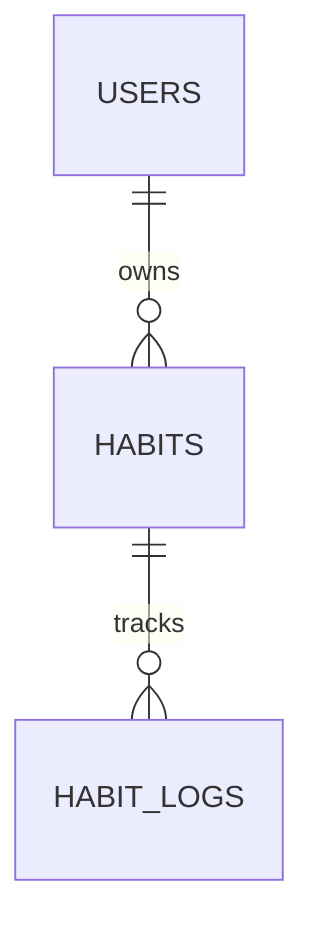

# Habit Tracker

Краткое описание:
Habit Tracker — учебный проект на FastAPI для отслеживания привычек.  
Пользователь может создавать привычки и отмечать их выполнение по датам.

---

## Статус
- Текущий шаг: инициализация проекта, настройка окружения.
- Далее: модели (SQLAlchemy), Pydantic-схемы, CRUD-эндпоинты, миграции (Alembic), деплой.

---

## Быстрый старт (Windows + PyCharm)

1. Клонировать репозиторий:
```bash
git clone https://github.com/amiamiur/habit-tracker.git
cd habit-tracker
```
2. Создать и активировать виртуальное окружение:
```bash
python -m venv .\venv
.\venv\Scripts\Activate
```
3. Установить зависимости:
```bash
pip install -r requirements.txt
```

4. Создать .env на основе .env.example и заполнить значения.

5. Запустить приложение (dev):
```bash
uvicorn app.main:app --reload --host 127.0.0.1 --port 8000
```

## Модель данных

В проекте используется реляционная база данных PostgreSQL.

### Сущности
- **User** — пользователь системы
- **Habit** — привычка пользователя
- **HabitLog** — отметка выполнения привычки по дате

### Связи
- User → Habit (1:N)
- Habit → HabitLog (1:N)


